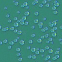
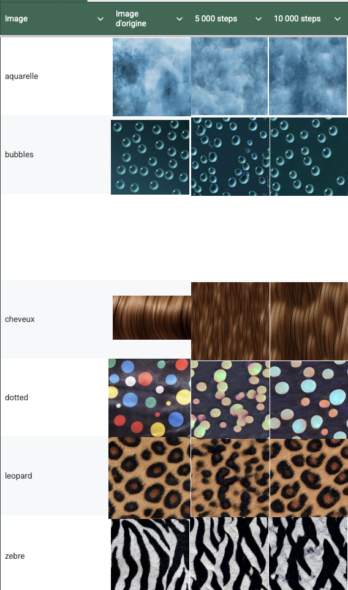
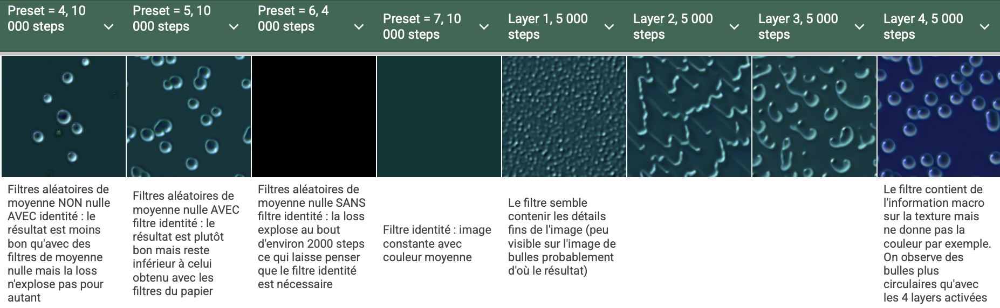

Guide:
- Tests: dossier images, avec les explications correspondantes dans le README
- Ici, le compte-rendu semaine par semaine

# Réunion 1: 06/05

### Prochaine réunion le 13/05

### Déroulement

#### Objectif: Parler du planning du projet, de son déroulement, et des modalités du rendu final.
Rendu toutes les semaines avec ce qu’on a fait - updates du SUIVI, réunions hebdomadaires (cf réunion mercredi prochain).

#### Approche technique:
Coder "from scratch" - choix confirmé pendant la discussion et après la réunion entre nous. Il existe des implémentations disponibles en ligne que l'on peut regarder si nécéssaire.
Utilisation de pytorch.

Projet initial: suivi du papier pour de la génération de textures.
Il existe plusieurs extensions:
* Multitexture - plusieurs types d’images.
* Textures dynamiques - coût plus élevé, à voir (trouver sources) - extension favorisée par le groupe.

Précisions: mentionner nos sources, si on reprend du code préexistant et toutes utilisations de l'IA.
Conseil d'utilisation de l'IA: surtout débuggage, commentaires… pas de génération directe à partir du papier.

Tests à faire au cours du projet:
* Tester si les opérateurs différentiels c’est crucial, pourquoi? Opérateur local? Moyenne nulle?
* Propagation autour d’un point? Sur le papier mise à jour de toutes les cellules en parallèle - ce qui constitue un gain de temps conséquent.

Loss: utiliser la référence 11 du papier (Gatys) ou IM01 pour les formules
-> peut utiliser un code préexistant, importer le VGG pré-entrainé (à faire dans un premier temps)

### Objectif minimal de la semaine
Première approche de l'importation du loss/modèle VGG. Prise en main des papiers.

# Semaine du 06/05 au 13/05

Proposition d'architecture, ajouts de fichiers de code qui définissent l'architecture du projet (non finis).
Importation dans loss.py du modèle VGG préexistant dans pytorch, voir la documentation: https://docs.pytorch.org/vision/stable/models/generated/torchvision.models.vgg16.html 
NB: j'ai importé le modèle dans la fonction déstinée à cela et bloqué les paramètres vu qu'on ne va pas l'entrainer. Il est déja entrainé sur IMAGENET, qui contient pleins de textures différentes donc qui est assez approprié.
Code pour calculer les matrices de Gram et la VGG loss

# Réunion 2: 13/05

### Prochaine réunion: 20/05 

Compte rendu oral da la semaine passée.
VGG venue de l'article de Gatis: code récupéré sur son github pour ce loss. Code un peu vieux, possibles problèmes de compatibilité.
Nouvelle source pour le code de cette partie: https://storimaging.github.io/notebooksImageGeneration/ 
explication du système de couches et paires... cf papier - layer spécifiques, pas premières couches trop simples ni trop sémantiques (dernières): entre deux. 
NB: tests de loss potentiels, montrer pourquoi cette combinaison loss/architecture marche.
Code sur les matrices de Gram a identifier, tests potentiellement un peu lents.

Question: Page 4, tirage aléatoire d'un N, pourquoi cela? Diversité... - à revenir/comprendre (ourquoi on change à chaque fois)

### Objectif de la semaine: 
architecture globale et premiers tests, ainsi que prise en main de la source envoyée.

# Semaine du 13/05 au 20/05

Remplissage du code: la semaine dernière nous avions créé une architecture vide, celle-ci est maintenant complète avec une première version. La loss a aussi étée changée selon les consignes données à la dernière réunion. Une partie de débuggage a aussi étée entamée, mais nous n'avons pas trouvé toutes les sources de problèmes (ou nous n'en sommes pas sûrs). En effet certains problèmes étaient minimes ( ie "loss += w * sum(F.mse_loss(G[i], A[0]) for i in range(G.shape[0]))" n'était pas divisé par 4, ce qui changeait la learning rate en théorie), et nous ne sommes pas certains qu'il s'agisse du ou d'un problème principal du code. 
  
Si on fixe le nombre de step au minimum ca ne change pas grand chose (esthétique).
  
Fix: les couleurs semblaient dégénérées, solutionné par clamp.
  
Code des matrices de Gram recopiée et comprise.

# Réunion 3: 20/05

### Prochaine réunion: à voir (mercredi potentiellement), à midi pile

Compte rendu de la semaine: tous les morceaux de code marchent ensemble. L'ensemble du papier est implémenté sauf les extensions finales. 
15/20 minutes d'execution du main (même avec GPU), jugée un peu long. A voir. Mais l'inférence est assez rapide donc étapes à séparer pour rendre cela plus rapide, qui est l'un des avantages supposé de cette méthode. Temps d'entrainement supposémment pas surprenant.
  
Matrice de Gram: regarder le reste du code.
  
Extensions potentielles: Textures dynamiques. Les sources peuvent être tirées du papier. Cela semble un peu compliqué tel quel mais il est envisageable d'imaginer une version plus simple et de s'approprier la technique. Le code est en ligne, donc vu la difficulté, le récuperer et le modifer suffit.

### Objectif de la semaine : 
Faire des tests (et comprendre les méchanismes derrière). Utiliser nos photos en plus des photos du papier. Tester les limites du modèle: filtres pas différenciels, mais tirés au hasard (attention moyenne nulle), checker ce que le papier "prétend", ou MaJ...  
  
Lire papier sur les textures dynamiques, tester leur code.
  
Il est préférable de clotûrer cette partie du code déjà faite avant de passer à autre chose (extension), donc il faut bien perfectionner, tester les limites et comprendre les propriétés importantes à garder avant de se lancer. 

# Semaine du 20/05 au 27/05

Tests effectués sur le code actuel: dossiers F1, F2, F3 disponibles dans le dossier image. Les détails des tests sont disponibles dans README.md. 

Tests effectués avec PRESET = 1 :

Globalement, il y a eu des tests sur les types de filtres, le clamp comme solution des couleurs aberrantes...
  
*Conclusions tirées:*
- Remplacer les filtres différentiels par des filtres aléatoires donne de bons résultats dès lors qu'ils sont de moyenne nulle
- L'utilisation du filtre I (matrice 3x3 avec un 1 au centre) semble toutefois indispensable
- D'autres filtres différentiels peuvent être utilisés à la place de Sobel mais ne donnent pas de meilleurs résultats (il faut faire attention à contrôler la loss)

Papier sur les textures dynamiques: https://openaccess.thecvf.com/content/CVPR2023/papers/Pajouheshgar_DyNCA_Real-Time_Dynamic_Texture_Synthesis_Using_Neural_Cellular_Automata_CVPR_2023_paper.pdf  

# Réunion 4: 27/05

### Prochaine réunion: Vendredi midi en visio 12h

Compte-rendu de la semaine: tests sur les filtres (moyenne nulle parait indispensable même si à priori il y a un moyen de normaliser autre, il n'a pas été atteint).  
Problème de couleurs sur les tests, potentiellement liés à la convergence (on peut essayer avec plus de pas). Peut être du à des modifications du code sur les matrices de Gramm. Voir pondération des couches, poids plus fort sur les premières qui gèrent cet aspect. Garder correlation forte entre les canaux couleurs (voir dernière image).  
Images avec des rayures, petit champ récepteur: l'erreur sur cette image n'est pas surprenante, ni grave.  
Globalement l'algorithme marche.  
Exercice; calculter le nombre de paramètre (vu qu'on vise à le réduire). A faire et comparer avec Gatis initial: cf papier (5 000 vs 20 000).  

### Objectif de la semaine : 
Séparer test et train, regarder mesures de textures. Rassembler les résultats sur les filtres utulisés, essayer de comprendre pourquoi. Monitoring du loss.  
Tester si on peut utiliser la même architecture pour deux exemples. Pourquoi ça marche/ne mmarche pas, est-ce que l'on peut conditionner (non trivial)...  
Créer branche textures dynamiques? Leur code est lourd avec des parties sûrement inutiles mais il sera dur de le nettoyer. Comprendre comment ça marche.  
Objectif peut-être plus long terme: créer un petit modèle dynamique simple (à priori il ne marchera pas).  
Envoyer lien sur ce que l'on à fait la veille, mercredi/jeudi (tests et conclusions...). Moins d'essais à pousser un peu plus.  

# Semaine du 27/05 au 05/06

### Amélioration de l'architecture mono-texture

Nous avons créé une grille de tests (cf. google sheet), mais n'étions pas satisfaits par les résultats obtenus. Les deux défauts principaux étaient les fausses couleurs, c'est-à-dire l'assombrissement de l'image, et la perte de structure, c'est-à-dire, pour l'image bubbles par exemple, l'apparition de bulles difformes et mal espacées. Pour solutionner ce problème, nous avons testé les couches unes par unes, afin de comprendre leur impact individuel (NB: nous avions déjà augmenté le poids des premières couches comme recommandé). Nous avons découvert que la dernière couche faisait la grande majorité du travail.

Nous avons eu beaucoup de mal à obtenir une version satisfaisante du code, mais au final nous sommes plutôt satisfaits de la version actuelle.  

Nous avons bien ajouté le monitoring du loss, et testé différents filtres (voir la description des presets dans le README).  

### Implémentation de l'architecture multi-textures

Nous avons également implémenté un premier jet de l'approche multi-textures en nous basant sur le papier « Multi-texture synthesis through signal responsive neural cellular automata » de Catrina et. al. ; notre code a ainsi été généralisé pour pouvoir entraîner un réseau permettant ensuite de synthétiser autant de textures que l'on veut (sous contrainte d'avoir un nombre de textures égal à une puissance de 2).
Nous avons effectué un premier test en entraînant le réseau sur deux textures — la texture leopard et la texture brique — pendant 4000 steps (soit environ 2000 steps d'entraînement pour chacune des deux textures). 
Le code semble bien fonctionner : 

